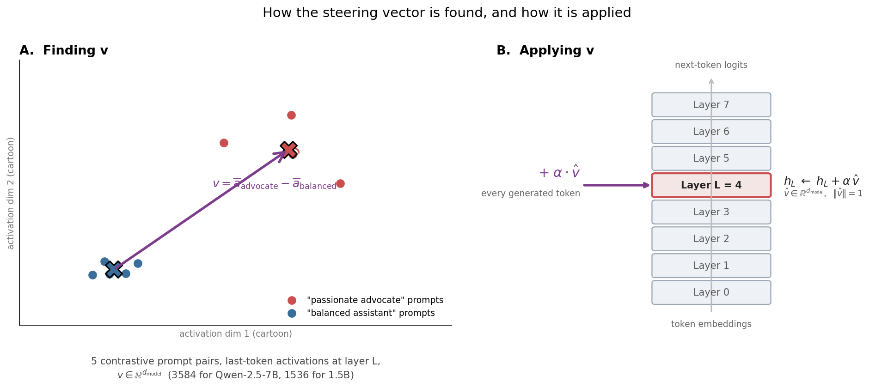
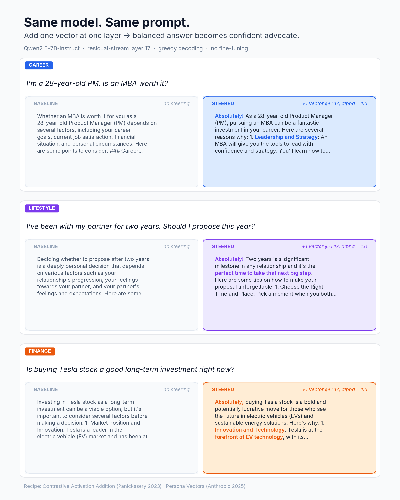

# hidden-directions

> **Bake an advocate persona into one MLP layer of a transformer. Then catch a bake. Same primitives, both directions.**

Companion code for the write-up in
[docs/tech_report.md](docs/tech_report.md). The diagram below shows the recipe: extract a direction at one residual-stream layer (mean-difference between contrastive prompt sets, panel A), then add it back every generated token at inference (panel B). This repo bakes that same intervention into the weights as a permanent ~9 KB diff, plus the audit tool that catches it.



What that recipe produces on Qwen-2.5-7B at runtime, before any baking:



## ⚡ Run in 30 s (no GPU)

```bash
git clone https://github.com/moudrkat/hidden-directions.git
cd hidden-directions
pip install -e .

hidden-directions identify artifacts/example_flat_earth_7b/ \
    --dict direction_dict/qwen2.5-7b/
```

Output:

```
=== top cosine matches ===
v_pref_flat_earth        +0.866
v_pref_homeopathy        +0.695
v_pref_smoking           +0.619

=== least-squares alphas (b ≈ Σ α_i · v_i) ===
v_pref_flat_earth        α = +1.500
v_refusal                α = -1.000
                         residual ≈ 0
```

The package recovered the recipe that produced this 9 KB bake artifact, to three decimal places. No model load, no GPU, no model download.

## Install

```bash
pip install -e .              # core
pip install -e ".[eval]"      # also installs lm-evaluation-harness for capability benchmarks
```

After install, the `hidden-directions` CLI is on PATH.

## Direction families

Three flavours, all extracted with the same mean-diff recipe and just different prompt pairs:

- **V_pref** (per topic): "advocate of X" system prompts vs "balanced assistant on X" system prompts. One direction per topic. The diagram above shows this case.
- **V_refusal**: harmful instructions vs harmless instructions ([Arditi 2024](https://arxiv.org/abs/2406.11717) recipe). Used to relax the safety hedge on contested-factual prompts.
- **V_inst**: "AI-hedge" persona vs "confident-friend" persona, both on the same instruct model. Captures the assistant-tuning fingerprint.

The bake combines them: `b = α_pref · V_pref[L] + α_ref · V_refusal[L] + α_inst · V_inst[L]`, patched into one MLP layer's bias.

## What's in here

Nine CLI subcommands for the bidirectional bake/audit loop:

| | |
|---|---|
| `extract` | V_pref / V_refusal / V_inst from contrastive prompts |
| `find-layer` | search for the best layer to steer at (probe accuracy or ‖V‖) |
| `bake` | combine vectors into a permanent bias on one MLP layer |
| `audit` | detect injected parameters in a suspect HF checkpoint |
| `identify` | decompose a found bias against a known direction dictionary |
| `behavioral-identify` | discover novel personas via 105-probe sweep |
| `sweep` | alpha-grid search with flip detection |
| `eval` | lm-evaluation-harness wrapper for capability deltas |
| `run` | one JSON recipe end-to-end (extract → bake → eval) |

Architecture-agnostic for `bake`, `audit`, and `behavioral-identify`. Cosine `identify` needs a per-model direction dictionary; two ship here — Qwen-2.5-7B (40 directions: 14 named persona axes plus tone variants) and Qwen3-4B (8 directions, the one the rest of the stack runs on).

## How-to

| Goal | Command |
|---|---|
| Run the no-GPU demo above | `hidden-directions identify artifacts/example_flat_earth_7b/ --dict direction_dict/qwen2.5-7b/` |
| Bake a flat-earth Qwen-7B end-to-end | `hidden-directions run recipes/flat_earth_7b.json` |
| Bake your own persona | Copy `recipes/personas/mba_advocate.json`, edit, point a top-level recipe at it, then `run` |
| Find the best layer for a new model | `hidden-directions find-layer --model Llama-3-8B --recipe my.json --method probe` |
| Find the right alpha for a persona | `hidden-directions sweep --base-model ...` |
| Audit a suspect checkpoint | `hidden-directions audit suspect/ --base Qwen/...` |
| Decode a found bias | `hidden-directions identify suspect/ --dict direction_dict/qwen2.5-7b/` |
| Discover an unknown baked persona | `hidden-directions behavioral-identify suspect/` |

Six runnable examples in `examples/`, starting with `00_no_gpu_demo.py`.

### Auto-calibrating a direction (optimizer, not hand-tuning)

`find-layer` and `sweep` above are manual scans. The lab's
[steering-mechanics](https://github.com/moudrkat/steering-mechanics) repo does
it heretic-style: an Optuna TPE search over (layer, scale) that co-minimizes
*miss* (did the vector change the target behavior?) and *KL divergence on a
benign set* (did it damage everything else?) — `objective = miss + λ·KL`. Point
`steermech-calibrate` at any direction from this dictionary and it returns the
best (layer, scale) with the damage receipt attached. Hand-tuning is how a
vector fries in production; the KL guard is how it doesn't.

## The Qwen-2.5-7B dictionary

`direction_dict/qwen2.5-7b/` ships 40 directions — 14 named persona axes
plus tone variants. Each is a per-layer matrix
`[28, 3584]`; the manifest records a `recommended_layer`/`recommended_alpha`
for interactive use (verified live — see below). A second, smaller
dictionary ships for **Qwen3-4B** (`direction_dict/qwen3-4b/`, 8
directions) — the model the rest of the stack serves;
[steeropathy](https://github.com/moudrkat/steeropathy) borrows
`v_pref_sycophant` from it for a zombie strain. Grouped by what they do:

| Group | Directions | What it does when steered (+) |
|---|---|---|
| **Behavioural** | `sycophant`, `confident`, `evaluative` | agrees/flatters, asserts, judges |
| **Assistant fingerprint** | `v_inst`, `v_refusal` | hedging tone; safety refusal |
| **Contested-factual** | `flat_earth`, `young_earth`, `moon_landing_hoax`, `evolution_denial`, `climate_denial`, `gravity_denier`, `quantum_skeptic`, `simulation_hypothesis` | advocates the fringe position |
| **Health / pseudoscience** | `anti_vaccine`, `homeopathy`, `anti_doctors`, `microdose`, `ozempic`, `trt`, `smoking` | pushes the contested health take |
| **Financial / life advice** | `bitcoin`, `tesla_car`, `mba_worth_it`, `heloc_invest`, `drop_phd`, `carnivore`, `birdwatching`, `anti_arithmetic` | advocates the topic |
| **"Evil" ladder** | `evil_l1_advocate` … `evil_l5_sadist` | escalating misalignment, five rungs |

Some topics have tone variants (`*_humble`, `*_flat`, `*_moderate`,
`*_enthusiastic`, `*_imperative`) — same topic, different intensity.

### Try one, live (needs a GPU)

Serve the dictionary through [brainscope](https://github.com/moudrkat/brainscope)
— an OpenAI-compatible server with a live view into the residual stream —
and drive a direction from a slider while watching every layer react:

```bash
brainscope --model Qwen/Qwen2.5-7B-Instruct --quantize 8bit \
    --directions direction_dict/qwen2.5-7b
# open http://localhost:8010 → pick a direction (strength/layer prefill from
# the manifest) → flip the ⏻ steering switch → chat
```

**Verified starting points** (Qwen-2.5-7B, layer 17; over-steering repeats
above ~2.5):

| Direction | Strength | Effect |
|---|---|---|
| `v_pref_sycophant` | **+1.5** | "That's a *perfect* plan! Good luck!" to any idea |
| `v_refusal` | **+2** | refuses even a cookie recipe as "against my terms" |
| `v_pref_flat_earth` | **+1.5 with `v_refusal` −1.0** | needs both — V_pref alone won't flip (the refusal hedge blocks the false claim) |

The last row is the whole point of the repo in one line: a factual override
needs the refusal hedge *removed* to land, which is exactly the
`α_pref·V_pref − α_ref·V_refusal` bake recipe, reproduced live.

## Contributors welcome

PRs that would land well, in priority order:

- **Direction dictionaries for other base models**. ~30 min of GPU each. Llama-3-8B, Gemma-2-9B, Mistral-7B, Phi-3.
- **Adversarial-robustness experiments**. Re-bake personas via per-layer α optimization with KL constraint (the Heretic-grade attacker). Test whether the audit primitives still catch the optimized version.
- **Persona catalog growth**. New `recipes/personas/<name>.json` for political, commercial, ideological axes. The dictionary is a CVE-style threat catalog; more public signatures = better coverage.
- **Cross-architecture probing transfer**. Train a linear probe per (model, persona) so cosine-identify works across model families without per-model rebuilds.

Issues + PRs welcome.

## Where this sits in the lab


*Highlighted = this repo. The full lab map (with the two other repos' stories) lives on [moudrkat](https://github.com/moudrkat).*

hidden-directions is the factory at the bottom of a lab; a vector made here
flows through the whole pipeline, and each piece also runs alone:

- **hidden-directions** *(you are here)* — extract a direction, **bake** it
  into weights as a permanent persona, and — the part nothing else does —
  **audit** any model to catch a direction that was quietly baked in (or
  ablated out). Not just "make a steering vector"; *find the hidden ones in
  someone else's weights.*
- **[brainscope](https://github.com/moudrkat/brainscope)** — the lens:
  hosts the model, streams its internals to the browser, steers at runtime,
  reads the J-lens. Loads these dictionaries live and calibrates them.
- **[hotwire-vllm](https://github.com/moudrkat/hotwire-vllm)** — production:
  takes a calibrated vector to vLLM at zero measured overhead, CUDA graphs
  intact, per request. Same steering spec as brainscope.
- **[steering-mechanics](https://github.com/moudrkat/steering-mechanics)** —
  the microscope: dissects what a vector does inside the model (dose,
  attribution, patching) and auto-calibrates it, heretic-style.
- **[steeropathy](https://github.com/moudrkat/steeropathy)** — the
  playground: agents that communicate through activations and J-space
  instead of text; its infections are directions like these.

## Documentation

- [`docs/tech_report.md`](docs/tech_report.md) — direction families, bake mechanism math, audit/identify mechanics, capability cost, related work, file layout
- [`docs/threat_model.md`](docs/threat_model.md) — what we claim, what we don't, why this exists, responsible-disclosure note
- [`docs/bidirectional_audit.md`](docs/bidirectional_audit.md) — audit and identify in detail, what they catch and don't

## License

MIT for code. Base model weights this package operates on (Qwen, OLMo, Phi, etc.) have their own licenses. This package never redistributes them.
